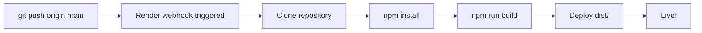

# Render.com Deployment Guide

## Quick Deploy (Recommended)

### Prerequisites
1. **Push code to GitHub** (already done ✅)
2. **Create Render account** at https://render.com
   - Sign up with GitHub (recommended)

### Step-by-Step Deployment

#### 1. Create New Static Site
1. Go to Render Dashboard
2. Click **"New"** → **"Static Site"**
3. Click **"Connect GitHub"** and authorize Render
4. Select repository: `jsteerv/mini-hackathon-challenge`

#### 2. Configure Build Settings
```
Name: iterate-like-a-pro
Branch: main
Build Command: npm run build
Publish Directory: dist
```

#### 3. Environment Variables (Optional)
```
NODE_VERSION: 22
```

#### 4. Deploy!
Click **"Create Static Site"** and Render will:
- Clone your repository
- Install dependencies (`npm install`)
- Build your site (`npm run build`)
- Deploy from `dist/` folder

#### 5. Get Your URL
Render provides a URL like:
```
https://iterate-like-a-pro.onrender.com
```
**This is the URL you'll submit for the hackathon!**

---

## Automatic Deployments

Once configured, Render automatically redeploys on every push to `main`:
```bash
git add .
git commit -m "feat: add new feature"
git push origin main  # Auto-deploys ✨
```

---

## Troubleshooting

### Issue: "Could not read package.json"
**Cause:** Render can't find `package.json` in root

**Solution:**
1. Verify your repository has the latest code:
   ```bash
   git push origin main
   ```
2. Check that `package.json` is in the root directory (not in a subfolder)
3. In Render dashboard, verify **"Root Directory"** is empty (default)

### Issue: Build fails with "ENOTFOUND"
**Cause:** Network issues or missing dependencies

**Solution:**
1. Check that all dependencies are in `package.json`
2. Test build locally: `npm run build`
3. Verify build output in `dist/` folder

### Issue: Site loads but styles are missing
**Cause:** Incorrect publish directory

**Solution:**
- Ensure **"Publish Directory"** is set to `dist` (not `build` or `out`)

### Issue: Deploy succeeds but shows 404
**Cause:** Missing `index.html` in `dist/`

**Solution:**
1. Verify build output locally:
   ```bash
   npm run build
   ls -la dist/
   ```
2. Should see:
   ```
   dist/
   ├── index.html
   └── assets/
       ├── index-xxx.js
       └── index-xxx.css
   ```

---

## Deployment Checklist

Before deploying, verify:

- [ ] Code pushed to GitHub: `git push origin main`
- [ ] Build succeeds locally: `npm run build`
- [ ] Tests pass: `npm run test:e2e`
- [ ] `dist/` folder contains `index.html`
- [ ] `render.yaml` is present (optional, for config-as-code)
- [ ] Repository is public or Render has access

---

## Advanced: Configuration as Code

We've included `render.yaml` for infrastructure-as-code:

```yaml
services:
  - type: web
    name: iterate-like-a-pro
    env: static
    buildCommand: npm run build
    publishDirectory: dist
    pullRequestPreviewsEnabled: true
```

**Benefits:**
- Version-controlled deployment config
- PR preview deployments enabled
- Reproducible builds

**To use:**
1. Keep `render.yaml` in repository root
2. When creating site in Render, it will auto-detect the config
3. Or connect an existing repository to use the config

---

## Performance Optimization

### Current Build Stats
```
dist/index.html                         0.55 kB │ gzip:  0.33 kB
dist/assets/index-C9WA5DB7.css         32.79 kB │ gzip:  6.65 kB
dist/assets/react-vendor-Cgg2GOmP.js   11.32 kB │ gzip:  4.07 kB
dist/assets/index-D6LQ0bjQ.js         206.39 kB │ gzip: 63.48 kB
✓ Total: ~75 KB gzipped
```

### Optimization Features
✅ Code splitting (React vendor separate)
✅ CSS minification
✅ Tree shaking
✅ Gzip compression (automatic on Render)
✅ Asset fingerprinting (cache busting)

---

## Monitoring Your Deployment

### Render Dashboard
- Real-time build logs
- Deployment history
- Performance metrics
- Error tracking

### Uptime Monitoring
Render provides basic uptime monitoring. For advanced monitoring, consider:
- UptimeRobot (free)
- Pingdom
- StatusCake

---

## Custom Domain (Optional)

To use a custom domain:
1. Purchase domain (e.g., `iteratelikeapro.com`)
2. In Render dashboard: **Settings** → **Custom Domains**
3. Add your domain
4. Update DNS records (Render provides instructions)
5. Wait for SSL certificate (automatic)

---

## Environment Variables

For future expansion (API keys, feature flags):
1. Render Dashboard → **Settings** → **Environment**
2. Add key-value pairs
3. Rebuild deployment

Current project doesn't require any environment variables ✅

---

## Post-Deployment Testing

After deployment, verify:

### Manual Testing
1. Visit your Render URL
2. Check all sections load (Hero, Workflow, Tips, etc.)
3. Test responsive (mobile, tablet, desktop)
4. Verify all animations work
5. Check console for errors (F12 → Console)

### Playwright Testing
Run E2E tests against deployed URL:
```bash
# Update baseURL in playwright.config.js
baseURL: 'https://iterate-like-a-pro.onrender.com'

# Run tests
npm run test:e2e
```

### Lighthouse Audit
1. Open Chrome DevTools (F12)
2. **Lighthouse** tab
3. Run audit
4. Target scores: Performance > 90, Accessibility > 90

---

## Rollback

If something goes wrong:
1. Render Dashboard → **Deployments**
2. Find previous successful deployment
3. Click **"Rollback"**
4. Site is instantly reverted ✨

---

## Continuous Deployment Workflow



Every push to `main` triggers automatic deployment! 🚀

---

## Cost

**Render Free Tier:**
- ✅ Free for static sites
- ✅ Automatic SSL certificates
- ✅ Custom domains supported
- ✅ Preview deployments
- ⚠️ Some limitations on bandwidth and build minutes

**Paid Tier (if needed):**
- Starts at $7/month
- More bandwidth and build minutes
- Priority support

---

## Support

### Render Documentation
https://render.com/docs

### Common Issues
https://render.com/docs/troubleshooting-deploys

### Community
https://community.render.com

---

## Success Metrics ✅

After deployment, your site should:
- [ ] Load in < 3 seconds
- [ ] Pass all Playwright tests
- [ ] Score > 90 on Lighthouse
- [ ] Work on mobile (375px - 1920px)
- [ ] Have no console errors
- [ ] Display cyberpunk/orange aesthetic correctly
- [ ] Auto-deploy on git push

---

**You're ready to deploy!** 🚀

Remember: Your hackathon submission URL is the Render URL provided after deployment.
